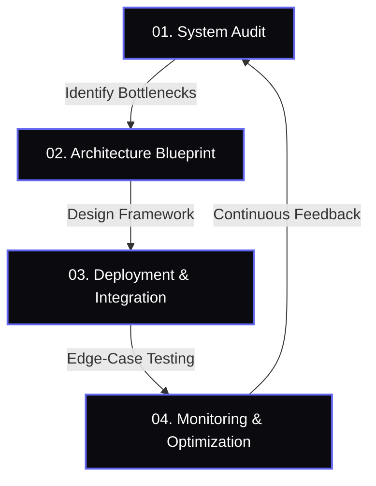

# 🏢 FlowForge AI
### Engineering Intelligent Systems for Growing Organizations

---

**"Your Business Should Run on Systems — Not Manual Work."**

*We don’t patch workflows. We engineer systems.*

[Book Automation Audit](mailto:shoebfaizan71@gmail.com) • [View Portfolio](https://github.com/Mohammad-Shoeb-Faizan) • [Connect on LinkedIn](https://www.linkedin.com/in/mohammad-shoeb-faizan/)

---

## ⚠️ The Cost of Operational Friction

Growing organizations often struggle with operational complexity that acts as a brake on growth. We eliminate these bottlenecks.

> [!IMPORTANT]
> **Every manual touchpoint increases risk.** Our mission is to reduce that risk to zero through robust system architecture.

### We Solve For:
- � **Manual CRM updates** after every payment
- 📉 **Spreadsheet-based reporting** that lags behind reality
- 📉 **LMS or onboarding** handled by hand
- 📉 **Disconnected tools** that don't communicate
- 📉 **Data errors** caused by repeated human intervention

---

## 🏗 How We Work: The Architecture-First Approach

We treat automation as a discipline of system architecture, not just "writing scripts".

---

## 🛠 Engineering Core Services

### 🔄 Business Process Automation
We design secure automation pipelines that eliminate repetitive tasks across your CRM, payment systems, and internal tools.

### 🤖 AI-Enhanced Workflow Systems
Intelligent workflows that automate communication, streamline approvals, and optimize operational decisions.

### 📊 Real-Time Dashboard Engineering
Live executive dashboards that deliver accurate metrics — without relying on manual spreadsheet reporting.

### 🔗 System Integration
Seamless synchronization between LMS platforms, CRMs, payment gateways, and analytics systems.

---

## � Impact Metrics

| Metric | Result |
| :--- | :--- |
| **Manual Enrollment** | 100% Eliminated |
| **Operational Delays** | 70% Reduction |
| **Data Accuracy** | 99% Across All Systems |
| **Spreadsheet Dependencies** | Reached Zero |

---

## 🏆 Selected Case Studies

> [!NOTE]
> **Education Platform Automation**
> Eliminated 100% manual LMS enrollments and integrated payment gateways with CRM synchronization, reducing onboarding delays by 70%.

> [!TIP]
> **Donation Intelligence System**
> Built automated donor data pipelines and campaign performance dashboards for real-time leadership tracking.

---

## 👤 About the Founder

**FlowForge AI** is a founder-led automation consultancy. Led by a full-stack developer and automation engineer with hands-on experience building:

- 🎓 **LMS automation pipelines**
- 🔁 **CRM synchronization systems**
- 📊 **Real-time dashboards**
- 💳 **Payment & API integrations**

> Every solution is designed with long-term reliability, clarity, and business scalability in mind.

---

## � Get Started

**If your business depends on manual processes, it’s time to redesign the system.**

[**Book an Automation Audit**](mailto:shoebfaizan71@gmail.com)

---

Built with ⚡ by <a href="https://github.com/Mohammad-Shoeb-Faizan">Mohammad Shoeb Faizan</a>

